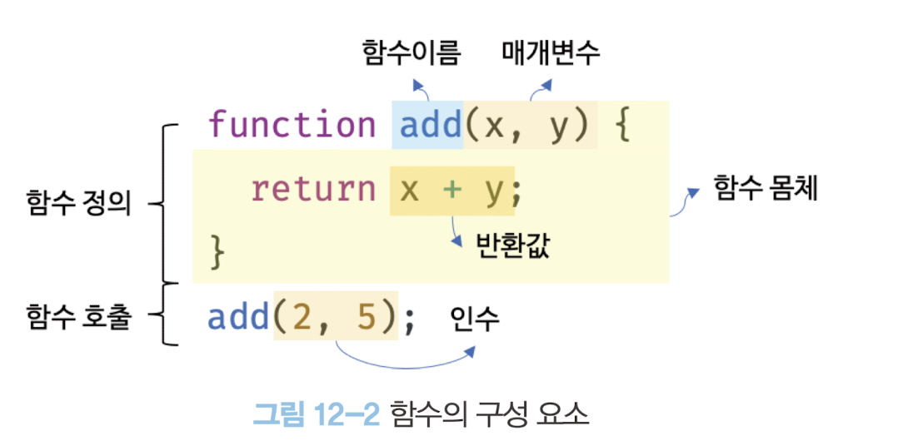
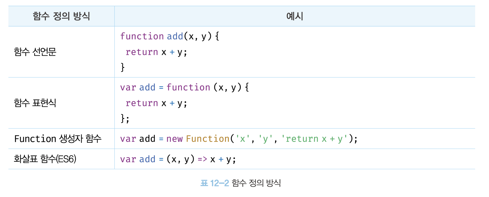
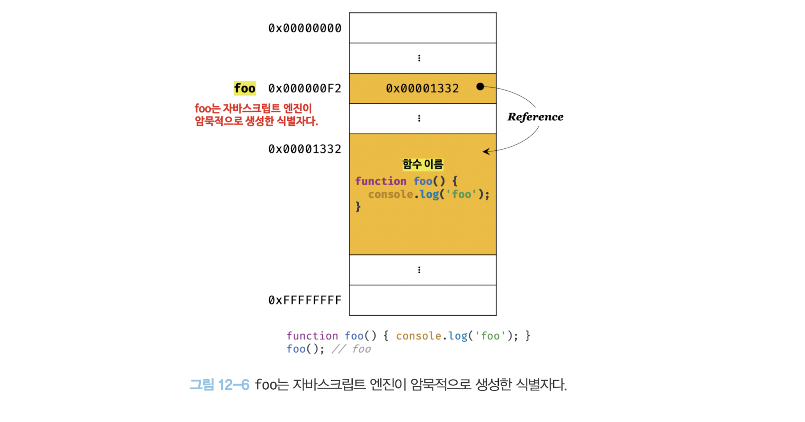
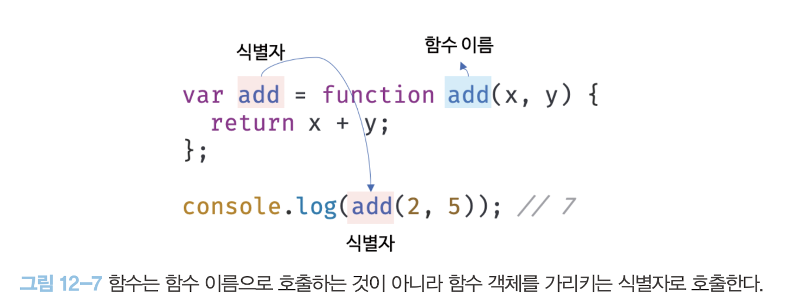
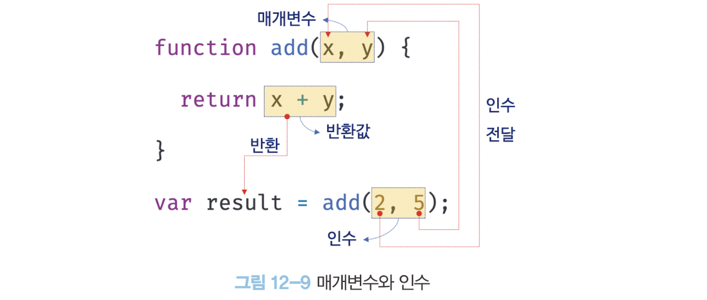
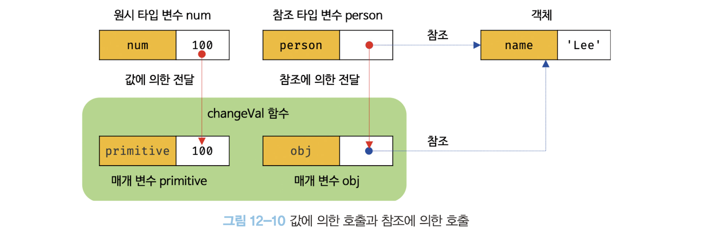

# 함수

## 함수란?
프로그래밍 언어의 함수는 일련의 과정을 문으로 구현하고 코드 블록으로 감싸서 하나의 실행 단위로 정의한 것이다.
- 함수 내부로 입력을 전달받는 변수를 매개 변수
- 입력을 인수
- 출력을 반환값



- 함수 **정의를 통해 생성**하고 **인수를 매개변수를 통해 전달하면**서 함수의 실행을 명시적으로 지시하여 **함수 호출**

## 함수를 사용하는 이유?
- 코드의 재사용을 위해
- 유지 보수의 편의성을 높이고 실수를 줄여 코드의 신뢰성 향상
- 함수 => 객체 타입의 값, 따라서 이름을 붙일 수 있어, 적절한 함수 네이밍을 통해 이람만으로도 역할을 알 . 수있게 하여 가독성을 향상


## 함수 리터럴
- 함수 리터럴은 function 키워드, 함수 이름, 매개 변수 목록, 함수 몸체로 구성
```jsx
// 함수 리터럴
function add(x, y) {
  return x + y;
};
```
- 함수 리터럴은 평가되어 값을 생성하며, 이 값은 객체이다. 즉, 함수는 객체 이다.
- 하지만 함수는 일반객체와 다르게 일반 객체는 호출할 수 없지만 함수는 호출할 수 있다.

## 함수를 정의 하는 방법



## 함수 선언문
- 함수 선언문은 함수 리터럴과 형태가 동일
  >단, 함수 리터럴은 함수 이름을 생략할 수 있으나, 함수 선언문은 함수 이름을 생략할 수 없다!

```jsx
// 함수 선언문
function add(x, y) {
  return x + y;
};
```

- 함수 선언문은 **표현식이 아닌 문** 이기 때문에,
함수 선언문을 실행하면 완료 값 `undefined`가 출력된다.
  >표현식이라면 표현식이 평가되어 생성된 함수가 출력되야 함
- 변수에 할당할 수 없다.

- 하지만 아래에 경우 함수선언문이 변수에 할당하는 것처럼 보인다.
  > **자바스크립트 엔진이 코드의 문맥에 따라** 동일한 함수 리터럴을 **표현식이 아닌 문인 함수 선언문**으로 해석하는 경우와 **표현식인 문인 함수 리터럴 표현식**으로 해석하는 경우가 있기 때문이다.

  ```jsx
  var add = function add(x, y) {
    return x + y;
  };

  console.log(add(2, 5)); 
  ```

- 자바스크립트 엔진은 생성된 함수를 호출하기 위해 **함수 이름과 동일한 이름의 식별자를 암묵적으로 생성하고, 거기에 함수 객체를 할당**
  
  

- 함수는 함수 이름으로 호출하는 것이 아니라 **함수 객체를 가리키는 식별자로 호출**

- 자바스크립트 엔진은 **함수 선언문을 함수 표현식으로 변환해 함수 객체를 생성**한다고 생각할수 있음!(하지만 두개가 동일하게 동작한다는 것은 아님)

>var add = function add(x, y)는 변수 add에 함수 객체를 할당했기 때문에 add를 통해 함수 호출이 가능


```jsx
(function bar() {
  console.log('bar');
});
bar(); // ReferenceError: bar is not defined
```
- bar();가 실행되지 않고 **ReferenceError: bar is not defined**가 발생하는 이유는 함수 표현식의 이름 스코프 범위와 관련

- **즉시 실행 함수 표현식 (IIFE)**
  - `(function bar() { ... });`는 함수 리터럴(익명 함수)을 소괄호로 감싸서 **함수 표현식(Function Expression)**으로 만든 것

  - bar라는 이름은 함수 내부에서만 접근 가능한 이름
  - 소괄호 ( )로 감싸면 더 이상 함수 선언문으로 간주되지 않고 함수 표현식으로 처리됩니다.

- **함수 이름의 스코프**
  - `function bar()`에서 bar는 함수 내부에서만 사용할 수 있는 함수 이름 스코프를 가짐. 
  - 즉, 함수 내부에서만 bar라는 이름으로 재귀 호출이나 참조가 가능
  - 하지만 함수 표현식 외부에서는 이름이 전역이나 호출 스코프에 노출되지 않아, 함수 표현식의 이름 bar는 코드의 외부에서 접근할 수 없음


>결과적으로
bar();는 함수 표현식 외부에서 호출하려는 시도이지만, bar라는 이름은 해당 스코프에 정의되지 않았기 때문에 **ReferenceError**가 발생


## 함수 표현식
- 자바스크립트의 함수는 일급 객체
  - 값처럼 변수에 할당할 수 있고,
  - 프로퍼티 값이 될수 있고,
  - 배열의 요소가 될 수 있다.

- 함수 표현식?
  - 함수는 일급 객체이므로 함수 리터럴로 생성한 함수 객체를 변수에 할당할수 있다.
  - 함수 표현식은 표현식인 문이다!!

```jsx
var add = function (x, y) {
  return x + y;
};
console.log(add(2, 5)); //7
```
- 함수 표현식의 함수 리터럴은 함수 이름을 생략하는 것이 일반적이다.
- 기명함수 표현식으로 함수를 정의 후 호출할 때 함수 이름을 호출하는 것이 아닌 **함수 객체를 가르키는 식별자로 호출**을 해야한다. 
- 함수 이름은 함수 몸체 내부에서만 유효한 식별자이기 때문에 오류가 발생한다.
  - ```jsx
    var add = function foo(x, y) {
      return x + y;
    };

    console.log(foo(2, 5));  // ReferenceError: foo is not defined
    ```

## 함수 생성 시점과 함수 호이스팅
- 함수 선언문으로 정의한 함수와 함수 표현식으로 정의한 함수의 생성 시점이 다름!

### `함수 선언문`으로 정의한 함수
- 함수 선언문 이전에 함수를 참조할 수 있으며 호출할 수도 **있다.** -> `함수 호이스팅 O`
- 함수 선언문으로 함수를 정의하면 런타임 이전에 함수 객체가 먼저 생성된다.
- 그리고, 자바스크립트 엔진은 함수 이름과 동일한 이름의 식별자를 암묵적으로 생성하거 생성된 함수 객체를 할당한다.
- 즉, 코드가 한줄 씩 순차적으로 실행되기 시작하는 **런타임에는 이미 함수 객체가 생성되어 있고 함수 이름과 동일한 식별자에 할당까지 완료된 상태**이다.

### `함수 표현식`으로 정의한 함수
- 함수 표현식으로 정의한 함수는 함수 표현식 이전에 호출할 수 **없다.**
- 함수 표현식은 **변수에 할당되는 값이 함수 리터럴인 문**이다.

따라서, 함수 표현식은 변수 선언문과 변수 할당문을 한번에 기술한 축약 표현과 동일하게 동작한다.

함수 표현식으로 함수를 정의하면 함수 호이스팅이 발생하는 것이 아니라 변수 호이스팅이 발생한다.


## function 생성자 함수
- 자바스크립트가 기본 제공하는 빌트인 함수인 Function 생성자 함수에 **매개변수 목록**과 함수 몸체를 **문자열**로 전달하면서 new 연산자와 함께 호출하면 함수 객체를 생성해서 반환

- 이 방식은 일반적이지 않으며 바람직하지도 않다.
  - 클로저를 생성하지 않는 등, 함수 선언문, 표현식으로 생성한 함수와 다르게 동작한다.
```jsx
var add = new Function('x', 'y', 'return x + y');

console.log(add(2, 5)); // 7
```

## 화살표 함수
- ES6에서 도입된 화살표 함수는 function키워드 대신 화살표 `=>` 를 사용해 좀 더 간략한 방법으로 함수를 선언하고, 항상 익명 함수로 정의한다. (자세한건 26장)

```jsx
var add = (x, y) => x + y;

console.log(add(2, 5)); // 7
```

- 화살표 함수는 기존의 함수보다 표현 뿐만이 아닌 **내부 동작 또한 간략화**되어 있다.
  - 생성자 함수로 사용할 수 없음
  - 기존 함수와 this 바인딩 방식이 다름
  - prototype 프로퍼티가 없음
  - arguments 객체를 생성하지 않음


## 함수 호출
- 함수를 가리키는 식별자와 한쌍의 소괄호()인 함수 호출 연산자로 호출
- 함수 호출을 하면 현재의 실행 흐름을 중단하고 호출된 함수로 실행 흐름을 옮김

### 매개변수와 인수
- 함수를 실행하기 위해 필요한 값을 함수 외부에서 함수 내부로 전달 필요가 있는 경우 매개변수(인자)를 통해 인수를 전달한다.

- 인수 : 함수를 호출할 때 지정하며, 개수와 타입에 제한이 없다.

- 매개변수 : 함수를 정의할 때 선언하며, 스코프(유효범위)는 함수 내부이다.

- 함수가 호출되면 함수 몸체 내에서 암묵적으로 매개변수가 생성되고 일반 변수와 마찬가지로 undefined로 초기화된 이후 인수가 순서대로 할당된다.



### 매개변수의 최대 개수
- 이상적인 매개변수 개수는 0개이며 적을수록 좋다.
- 이상적인 함수는 한 가지 일만 해야하며 가급적으로 작게 만들어야 한다.
- 따라서 매개 변수는 최대 3개 이상 넘지 않는 것을 권장하며, 그 이상의 매개변수가 필요하다면 하나의 매개 변수를 선언하고 객체를 인수로 전달하는 것이 유리하다.

###  반환문
- 함수는 return 키워드와 표현식(반환값)으로 이뤄진 반환문을 사용해 실행 결과를 함수 외부로 반환할 수 있다.

- 반환문은 두가지 역할을 한다.
  - 반환문은 함수의 싱행을 중단하고 함수 몸체를 빠져나간다. 따라서 반환문 이후 다른 문이 존재하면 그 문은 실행되지 않고 무시 된다.
  - 반환문은 return 키워드 뒤에 오는 표현식을 평가해 반환한다. return 키워드 뒤에 반환값으로 사용할 표현식을 명시적으로 지정하지 않으면 `undefined`가 반환된다.

## 참조에 의한 전달과 외부상태의 변경
- 매개변수도 함수 몸체 내부에서 변수와 동일하게 취급되므로 매개변수 또한 타입에 따라 **값에 의한 전달, 참조에 의한 전달 방식**을 그대로 따른다.



```jsx
// 매개변수 primitive는 원시값을 전달받고, 매개변수 obj는 객체를 전달받는다.
function changeVal(primitive, obj) {
  primitive += 100;
  obj.name = 'Kim';
}

// 외부 상태
var num = 100;
var person = { name: 'Lee' };

console.log(num);    // 100
console.log(person); // {name: "Lee"}

// 원시값은 값 자체가 복사되어 전달되고 객체는 참조값이 복사되어 전달된다.
changeVal(num, person);

// 원시값은 원본이 훼손되지 않는다.
console.log(num);    // 100

// 객체는 원본이 훼손된다.
console.log(person); // {name: "Kim"}
```
### 원시 타입 인수
값 자체가 복사되어 매개변수에 전달되기 때문에 함수 몸체에서 그 값을 변경(재할당을 통한 교체)해도 원본은 훼손되지 않음!
-> 부수효과(side effect) 발생 x

### 객체 타입 인수
- 참조 값이 복사되어 매개변수에 전달되기 때문에 함수 몸체에서 참조 값을 통해 객체를 변경할 경우 원본이 훼손된다.
-> 부수 효과(side effect) 발생

=> 이러한 문제의 해결 방법 중 하나는 객체를 불변 객체로 만들어 사용하는 것!
  > 즉, **깊은 복사**를 통하여 새로운 객체를 생성하고 재할당을 통해 교체!
  
  > 이를 통해 외부 상태가 변경되는 부수 효과를 없앨 수 있다

## 다양한 함수의 형태
### 즉시 실행 함수
```jsx
//익명 즉시 실행 함수
(function () {
  var a = 3;
  var b = 5;
  return a*b;
} ());
```
- 함수 정의와 동시에 즉시 호출되는 함수
- 단 한번만 호출
- 즉시 실행 함수는 그룹 연산자(...)로 감싸야하며, 익명 함수로 사용하는 것이 일반적

### 재귀 함수
```jsx
// 함수 표현식
var factorial = function foo(n) {
  // 탈출 조건: n이 1 이하일 때 재귀 호출을 멈춘다.
  if (n <= 1) return 1;
  // 함수를 가리키는 식별자로 자기 자신을 재귀 호출
  return n * factorial(n - 1);

  // 함수 이름으로 자기 자신을 재귀 호출할 수도 있다.
  // console.log(factorial === foo); // true
  // return n * foo(n - 1);
};

console.log(factorial(5)); // 5! = 5 * 4 * 3 * 2 * 1 = 120
```
- 재귀 함수는 자기 자신을 호출하는 행위
- 재귀 함수는 자신을 무한 재귀호출하기 때문에 멈출 수 있는 탈출 조건을 반드시 만들어야 함! 
- 탈출 조건이 없으면 함수가 무한 호출되어 스택 오버플로 에러가 발생

### 중첩 함수
```jsx
function outer() {
  var x = 1;

  // 중첩 함수
  function inner() {
    var y = 2;
    // 외부 함수의 변수를 참조할 수 있다.
    console.log(x + y); // 3
  }

  inner();
}

outer();
```
- 함수 내부에 정의된 함수를 **중첩 함수 또는 내부 함수**
- 중첩 함수를 포함하는 함수는 **외부 함수**
- 중첩 함수는 외부 함수 내에서만 호출할 수 있다.
- 일반적으로 중첩 함수는 자신을 포함하는 외부 함수를 돕는 헬퍼 함수의 역할


## 콜백 함수
```jsx
// 외부에서 전달받은 f를 n만큼 반복 호출한다
function repeat(n, f) {
  for (var i = 0; i < n; i++) {
    f(i); // i를 전달하면서 f를 호출
  }
}

var logAll = function (i) {
  console.log(i);
};

// 반복 호출할 함수를 인수로 전달한다.
repeat(5, logAll); // 0 1 2 3 4

var logOdds = function (i) {
  if (i % 2) console.log(i);
};

// 반복 호출할 함수를 인수로 전달한다.
repeat(5, logOdds); // 1 3
```
- 함수의 매개변수를 통해 다른 함수의 내부로 전달되는 함수
- 고차 함수 : 매개변수를 통해 함수의 외부에서 콜백 함수를 전달받은 함수
- 고차 함수는 
  - 콜백 함수를 자신의 일부분으로 합성하며
  - 매개변수를 통해 전달받은 콜백 함수의 호출 시점을 결정해서 호출한다.
- 콜백 함수는 고차 함수에 의해 호출되며 이때 고차 함수는 필요에 따라 함수에 인수를 전달할 수 있다.

```jsx
//콜백 함수를 사용한 이벤트 처리
//myButton 버튼을 클릭하면 콜백 함수 실행
document.getElementbyId('myButton').addEventListener('click', function () {
	console.log('button clicked!');
});

// 콜백 함수를 사용한 비동기 처리
// 1초 후에 메시지 출력
setTimeout(function () {
	console.log('1초 경과');
});
```
- 콜백 함수는 함수형 프로그래밍 패러다임뿐만 아니라 **비동기 처리(이벤트 처리, Ajax 통신, 타이머 함수 등)에 활용**되는 중요한 패턴으로 사용!
- 콜백 함수는 배열 고차 함수(map, filter, reduce)에서도 사용

## 순수 함수와 비순수 함수
- 순수 함수 : 어떤 외부 상태에 의존하지도 않고 변경되지도 않는, 부수 효과가 없는 함수
```jsx
var count = 0; // 현재 카운트를 나타내는 상태

// 순수 함수 increase는 동일한 인수가 전달되면 언제나 동일한 값을 반환한다.
function increase(n) {
  return ++n;
}

// 순수 함수가 반환한 결과값을 변수에 재할당해서 상태를 변경
count = increase(count);
console.log(count) // 1

count = increase(count);
console.log(count) // 2
```
- 비순수 함수 : 외부 상태에 의존하거나 외부상태를 변경하는, 부수효과가 있는 함수
```jsx
var count = 0; // 현재 카운트를 나타내는 상태: increase 함수에 의해 변화한다.

// 비순수 함수
function increase() {
  return ++count; // 외부 상태에 의존하며 외부 상태를 변경한다.
}

// 비순수 함수는 외부 상태(count)를 변경하므로 상태 변화를 추적하기 어려워진다.
increase();
console.log(count) // 1

increase();
console.log(count) // 2
```


## 인상 깊었던 말
```
코드는 동작하는 것만이 존재 목적은 아니다. 코드는 개발자를 위한 문서이기도 하다. 따라서 사람이 이해할 수 있는 코드, 즉 가독성이 좋은 코드가 좋은 코드다.
```

## 궁금한 점
다들 `console.dir()` , `console.error()` 많이 쓰는지