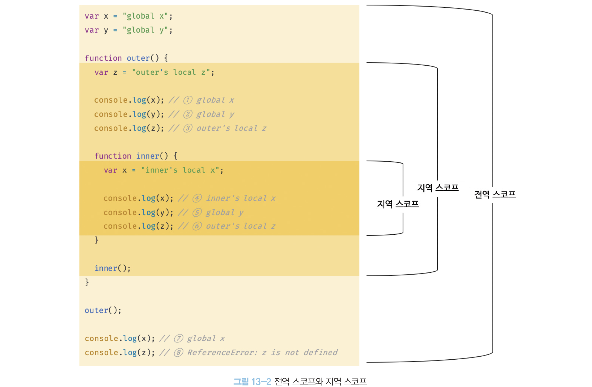
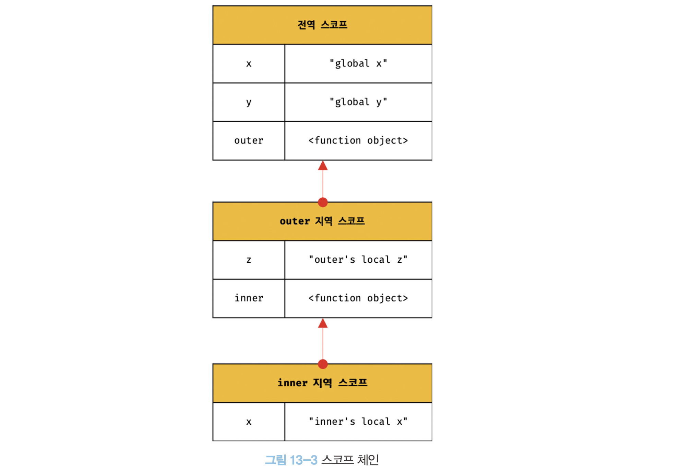

# 스코프
- 스코프(유효범위)는 자바스크립트를 포함한 모든 프로그래민 언어의 기본적이며 중요한 개념
- 모든 식별자(변수 이름, 함수 이름, 클래스 이름 등)는 자신이 선언된 위치에 의해 다른 코드가 식별자 자신을 참조할 수 있는 유효 범위가 결정
- 자바스크립트의 스코프는 다른언어의 스코프와 구별되는 특징이 있음
- var로 선언한 변수와 let, const 로 선언한 변수의 스코프도 다르게 동작

```jsx
var x = 'global';
function foo() {
  var x = 'local';
  console.log(x); // (1) local
}
foo();
console.log(x); // (2) global
```
```
local
global
```
1. 변수 스코프(scope)
- var 키워드로 선언된 변수는 함수 스코프를 가짐.
- foo 함수 내부에서 var x = 'local';을 선언했으므로, 이 변수는 **함수 내부에서만 유효**합니다. 함수 내부의 x는 전역 변수 x와는 별개의 변수
2. 첫 번째 console.log(x)
- foo 함수 내부에서 선언된 지역 변수 x가 **local**이라는 값을 가지므로, 'local'이 출력

3. 두 번째 console.log(x)
- foo 함수가 실행된 이후에는 전역 변수 x에 접근
- 전역 변수 x는 여전히 'global' 값을 유지하고 있으므로, 'global'이 출력

## 스코프의 종류
전역(global)과 지역(local)으로 구분!



| 구분 | 설명             | 스코프       | 변수                                            |
|------|------------------|--------------|------------------------------------------------|
| 전역 | 코드의 가장 바깥 영역 | 전역 스코프   | 전역 변수 (전역 변수는 어디서든지 참조할 수 있다.) |
| 지역 | 함수 몸체 내부   | 지역 스코프   | 지역 변수 (지역 변수는 자신의 지역 스코프와 하위 스코프에서 유효하다.) |


## 스코프 체인
- 스코프는 함수의 중첩에 의해 계층적인 구조를 가짐
- 스코프가 계층적으로 연결된 것을 스코프 체인
- 변수를 참조할 때 자바스크립트 엔진은 스코프 체인을 통해 변수를 참조하는 코드의 스코프에서 시작하여 상위 스코프 방향으로 이동하며 선언된 변수를 검색




### 렉시컬 환경
- 스코프 체인은 실행 컨텍스트의 렉시컬 환경을 단방향으로 연결한 것
- 전역 렉시컬 환경은 코드가 로드되면 곧바로 생성되고 함수의 렉시컬 환경은 함수가 호출되면 곧바로 생성

## 스코프 체인에 의한 변수 검색
- 스코프 체인을 따라 변수를 참조하는 코드의 스코프에서 시작해서 상위 스코프 방향으로 이동하며 선언된 변수를 검색
- 절대 하위 스코프로 내려가면서 식별자를 검색하는 일은 없다.


## 스코프 체인에 의한 함수 검색
- 함수도 식별자에 할당되기 때문에 스코프를 가짐
- 함수는 식별자에 함수 객체라 할당된 것 외에는 일반 변수와 다를 바 없음
- 스코프 = 식별자를 검색하는 규칙


## 함수 레벨 스코프
- 지역은 함수 몸체 내부를 말하고 지역 스코프를 만드는데, 이는 **코드 블록이 아닌 함수에 의해서만 지역 스코프가 생성된다는 의미**
- var 키워드로 선언된 변수는 오로지 함수의 코드 블록(함수 몸체) 만을 지역 스코프로 인정 => 함수 레벨 스코프

```jsx
var i = 10;

// for 문에서 선언한 i는 전역 변수다. 이미 선언된 전역 변수 i가 있으므로 중복 선언된다.
for (var i = 0; i < 5; i++) {
  console.log(i); // 0 1 2 3 4
}

// 의도치 않게 변수의 값이 변경되었다.
console.log(i);   // 5
```

## 블록 레벨 스코프
- 함수 몸체만이 아니라 모든 코드 블록(if, for, while, try/catch 등)이 지역 스코프로 인정 => 블록 레벨 스코프
- var 키워드로 선언된 변수는 오로지 함수의 코드 블록만을 지역 스코프로 인정하지만 ES6에서 도입된 let, const 키워드는 블록 레벨 스코프를 지원

## 렉시컬 스코프
- 함수를 어디서 정의했는지에 따라 함수의 상위 스코프를 결정하는것
- 자바스크립트는 렉시컬 스코프를 따르므로 함수를 어디서 호출했는지가 아니라, **함수를 어디서 정의했는지에 따라 상위 스코프를 결정**한다.
- 함수가 호출된 위치는 상위 스코프 결정에 어떠한 영향도 주지 않음 => 함수의 상위 스코프는 언제나 자신이 정의된 스코프다.
- 함수의 상위 스코프는 **함수 정의가 실행될 때 정적으로 결정**된다.
- 함수 정의(함수 선언문 또는 함수 표현식)가 실행되어 함수 객체는 이렇게 결정된 상위 스코프를 기억한다.
- 함수가 호출될 때마다 함수의 상위 스코프를 참조할 필요가 없기 때문이다.
