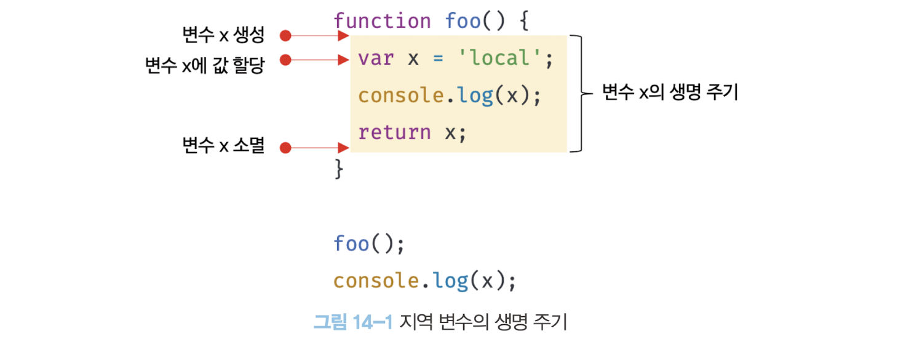
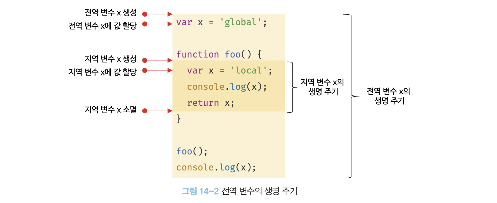
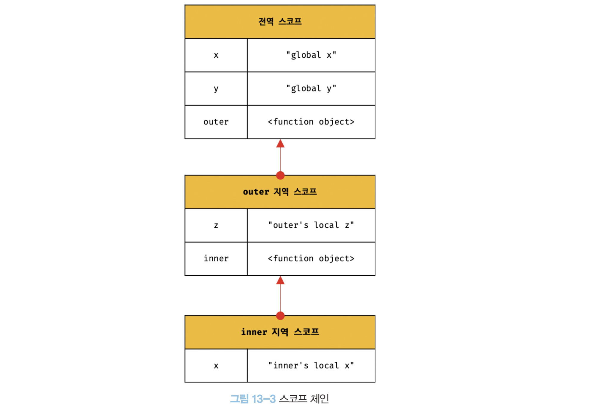

# 전역변수의 문제점
- 전역변수의 무분별한 사용은 위험하다.
- 전역 변수를 반드시 사용해야 할 이유를 찾치 못한다면 지역 변수를 사용
=> 개발할 때 조심해야겠다..!

## 변수의 생명 주기
### 지역 변수의 생명 주기

- 함수 내부에서 선언된 지역 변수는 함수가 호출되면 생성되고 함수가 종료되면 소멸
- 지역 변수의 생명 주기는 함수의 생명 주기와 대부분 일치
- 함수 몸체 내부에서 선언된 지역 변수의 생명 주기는 함수의 생명 주기와 대부분 일치하지만 지역 변수가 함수보가 오래 생존하는 경우도 있다.
- 변수의 생명 주기는 **메모리 공간이 확보(allocate)**된 시점부터 **메모리 공간이 해제(release)되어 가용 메모리 풀(memory pool)에 반환**되는 시점까지
- 누군가가 메모리 공간을 참조하고 있으면 해제되지 않고 확보된 상태로 남아있게 된다. => 이는 스코프도 마찬가지다. 누군가 스코프를 참조하고 있으면 스코프는 소멸하지 않고 생존하게 됨!

### 전역 변수의 생명 주기

- 함수는 함수 몸체의 마지막 문 또는 반환문이 실행 되면 종료되지만 **전역 코드는 반환문을 사용할 수 없으므로 마지막 문이 실행되어 더 이상 실행할 문이 없을 때 종료**한다.
- var 키워드로 선언한 전역 변수는 전역 객체의 프로퍼티가 된다. 이는 전역 변수의 생명주기가 전역 객체의 주기와 일치하는 것을 말한다.

#### 전역 객체
- 전역 객체는 자바스크립트 코드 실행 이전 단계에서 생성되는 특수한 객체입니다.
- 브라우저 환경: `window`, Node.js 환경: `global`을 사용.
- 포함 내용:
  - 표준 빌트인 객체 (e.g., `Object`, `String`)
  - 환경별 호스트 객체
  - `var` 키워드로 선언된 전역 변수와 함수

---

## 전역 변수의 문제점

### 암묵적 결합
- 전역 변수는 코드 어디에서나 접근 및 수정이 가능해 의도치 않은 상태 변경을 초래.
- 코드의 가독성을 떨어뜨리고 유지보수를 어렵게 만듦.

### 긴 생명주기
- 전역 변수는 애플리케이션이 종료될 때까지 메모리를 점유.
- 생명주기가 긴 변수는 이름 중복 및 재할당 문제를 유발할 가능성이 높음.

### 스코프 체인의 종점에 위치

- 전역 변수는 스코프 체인의 끝에 위치하므로 검색 속도가 느려짐.

### 네임스페이스 오염
- 자바스크립트는 파일이 분리되어 있어도 동일한 전역 스코프를 공유.
- 다른 파일에서 동일한 이름을 사용하는 경우 충돌 가능성 존재.

---

## 전역 변수 사용 억제 방법
전역 변수를 반드시 사용해야 할 이유를 찾지 못한다면 지역 변수를 사용해야한다. **변수의 스코프는 좁을수록 좋다.**

### 즉시 실행 함수 (IIFE)
- 코드를 즉시 실행 함수로 감싸 전역 변수를 생성하지 않음.
- 모든 코드를 즉시 실행 함수로 감싸면 모든 변수는 즉시 실행 함수의 지역 변수가 된다.
```javascript
(function () {
  let foo = 10;
  console.log(foo); // 지역 변수
})();
```

### 네임스페이스 객체
- 전역 객체를 생성하고 속성으로 변수를 추가.

```javascript
let MYAPP = {};
MYAPP.name = "Example";
```

### 모듈 패턴
- 모듈 패턴은 클래스를 모방해서 관련이 있는 변수와 함수를 모아 즉시 실행 함수로 감싸 하나의 모듈을 만든다.
- 관련 변수와 함수를 즉시 실행 함수로 감싸 캡슐화와 정보 은닉 구현.

```javascript
var Counter = (function () {
	//private 변수
	var num = 0;
  
  	// 외부로 공개할 데이터나 메서드를 프로퍼티로 추가한 객체를 반환한다.
  	return {
    	increase() {
        	return ++num;
        },
      	decrease() {
        	return --num;
        }
    }
}());

//private 변수는 외부로 노출되지 않는다.
console.log(Counter.num); //undefined

console.log(Counter.increase()); // 1
console.log(Counter.increase()); // 2
console.log(Counter.decrease()); // 1
console.log(Counter.decrease()); // 0
```


#### 캡슐화
- 객체의 상태를 나타내는 프로퍼티와 프로퍼티를 참조하고 조작할 수 있는 동작인 메서드를 하나로 묶는 것
- 캡슐화는 객체의 특정 프로퍼티나 메서드를 감출 목적으로 사용하기도 하는데 이를 정보 은닉(information hiding)이라 함.
- 퍼블릭 멤버 : 반환되는 객체의 프로퍼티는 외부에 노출
- 프라이빗 멤버 : 외부로 노출하고 싶지 않은 변수나 함수는 반환하는 객체에 추가하지 않으면 외부에서 접근할 수 없음

### ES6 모듈
- 모듈 스코프를 제공하며 전역 변수 없이 코드 작성 가능.
- 하지만 구형 브라우저에서는 동작하지 않으므로 번들링 필요.
- script 캐그에 type="module" 어트리뷰트를 추가하면 로드된 자바스크립트 파일은 모듈로서 동작한다. 모듈의 파일확장자는 mjs를 권장

```
<script type='module' scr='lib.mjs'></script>
<script type='module' scr='app.mjs'></script>
```